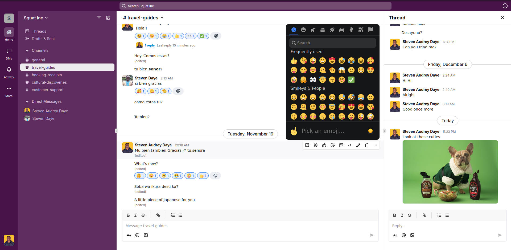

# Slack Clone | Real Time Collaboration App

🔗 Production Link URL: [Team Collaboration App](https://slack-clone-nine-murex.vercel.app/)

This is a lighweight version of Slack App. This clone covers the core fundamental features of Slack and what it was designed for: **Productivity Tool**.

## Status: Completed

I'm building a Slack clone using Next.js 14, Convex Realtime Backend, TypeScript, TailwindCSS, and Schadcn UI. The project will include features like user authentication, workspace and channel management, real-time messaging, file sharing, and emoji reactions. Next.js will power the front-end, while Convex will handle real-time communication, with TypeScript ensuring code quality and TailwindCSS and Schadcn UI providing a modern and cohesive design.

### Technologies

- **Next.js 14**: Utilized for building the front-end interface and ensuring a seamless, server-rendered application.
- **Convex Realtime Backend**: Powers real-time communication features, enabling instant messaging and updates.
- **TypeScript**: Provides type safety and improves code maintainability across the project.
- **TailwindCSS**: Used for designing a responsive and modern user interface.
- **Schadcn UI**: Helps in building reusable and consistent UI components.

### Features Covered

- **Register / Login**: Implemented user authentication and session management using Next.js and TypeScript.
- **Create / View a workspace**: Users can create and manage workspaces, leveraging Convex Realtime Backend for real-time updates.
- **Create / View a channel**: Channels within workspaces are created and viewed, facilitated by Convex for instant data synchronization.
- **Invite a member**: Members can be invited to join workspaces, using TypeScript for handling invitation logic and validation.
- **Join a workspace**: Users can join existing workspaces, with real-time updates handled by Convex.
- **Send one-on-one messages**: Direct messaging between users is enabled with real-time backend support.
- **Broadcast messages into channels**: Users can send broadcast messages within channels, using Convex for real-time broadcasting.
- **Send files & Media**: File and media sharing within messages, supported by Next.js for handling uploads and TailwindCSS for styling.
- **Add Emoji reaction to messages**: Emoji reactions are added to messages, enhancing user interaction, with Schadcn UI ensuring a consistent design.

After deploying the Slack clone, the application successfully demonstrated seamless real-time communication and collaboration features. The integration of Next.js, Convex, and TypeScript ensured a robust and maintainable codebase, while TailwindCSS and Schadcn UI provided a sleek and user-friendly interface. Users can now effortlessly manage workspaces, channels, and messages, enjoying a rich set of features akin to Slack. This project highlights the potential of modern web technologies to create dynamic and interactive applications.
